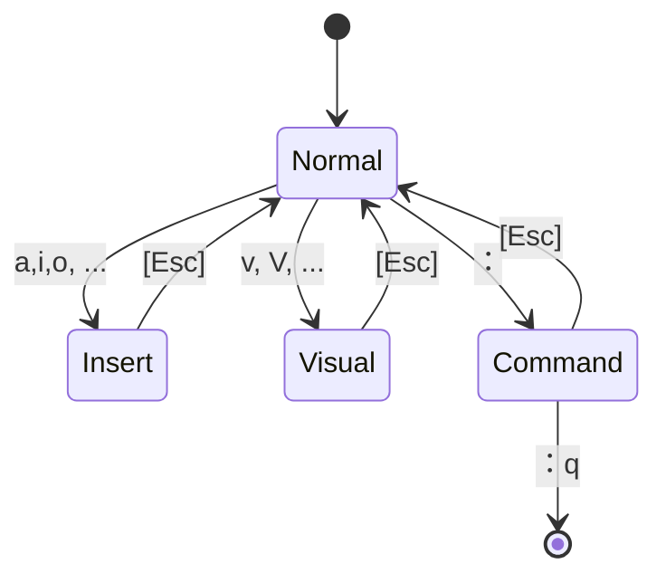

:::message
本記事はVim駅伝2024年11月1日の記事です。
:::
# はじめに


9月の末ごろからWezTermを触り始めて、LazyGitなどを入れてみると、ターミナルで全て完結できるのがいいなと思い始めました。そこで、いっそのことneovimを使ってコーディングに使っているエディタもターミナルで完結しようかと思いました。

# 環境

実行環境は以下の通りです。

* macOS Sequoia 15.0
* WezTerm (zsh)
* neovim: v0.10.1
  * プラグインマネージャー: lazy.nvim

# 現在のコーディング環境

現在のコーディング環境は以下のようになっています。

| 項目 | 現在 |
|:---:|:---:|
| Terminal | WezTerm |
| IDE | JetBrains( PyCharm, WebStorm, PhpStorm ) + VSCode |
| Git Client | Fork |
| Database Client | DataGrip |

TerminalにはWezTermを使っています。使い始めたのは最近ですが設定をテキストで管理できるのでとても良いです。以前はiTerm2を使っており、ストレスはなかったのですが今ではWezTermの方が良いなと思っています。

コーディングで主に使っているのはJetBrainsのIDEです。JetBrainsのIDEは、デフォルトで各種言語の補完が効き、プラグインを追加しなくてもストレスなくコーディングできるのが良い点だと思っています。またどちらかというと、JetBrainsにプラグインの追加はしたくないです。プラグインの追加はGUIベースになるため、管理が煩雑になるのと異なる環境間での共有が難しいためです。もちろん、export機能を使えばいいのですが、設定を変更するたびにexportしてimportしてというのは煩雑な作業なためです。

VSCodeは、csvやjsonなどのテキストファイルを開いて確認・編集するときに使っています。VSCodeに関しても、JetBrainsのIDEと同様の理由でプラグインの追加はしたくないです。プラグインの追加をしていないためコーディングには使えず、利用頻度は低めです。`Curosr`などの生成AIを組み込んだVSCodeベースのエディタも出てきていますがほとんど使っていないです。

コーディング以外のアプリケーションでは、GitクライアントのForkを利用しています。名前がGitのforkとかぶっているので検索するのが大変なのですが、シンプルな見た目とgit-flowの機能もデフォルトで利用できて便利です。DatabaseクライアントにはJetBrainsのDataGripを利用しています。PyCharmやWebStormからでもほぼ同様のDatabaseクライアントが利用できるのですが、Database接続専用のクライアントがあるとシンプルになるのでDataGripを利用しています。


各ソフトで利用している機能は以下の通りです。

 機能 | アプリケーション |
|:---:|:---:|
| 補完・エラー機能| IDE |
| 関数の定義ジャンプ | IDE |
| 誤字検出 | IDE |
| リポジトリ内全体での文字列検索 | IDE |
| Git Blame| IDE |
| コンフリクトの解消| IDE |
| ライブラリの最新バージョンの確認 | IDE |
| GitFlowに従ったブランチ管理 | Fork |
| 行ごとのコミット、プッシュ機能 | Fork |
| スタッシュ | Fork |


## これからのコーディング環境

そのため、上述の機能を他のアプリケーションで使えれば、問題ないです。これからのコーディング環境を以下に示します。


| 項目 | 現在 | これから |
|:--:|:--:|:--:|
| Terminal | WezTerm | 同じ |
| IDE | JetBrains系 | neovim (+ plugins) |
| Git Client | Fork | Lazygit |
| Database Client | DataGrip | 同じ |


これまでvimに対しては、操作が難しいと言う心理的なハードルがあったため、今まで使ったことがありませんでした。しかし、`~/.config`以下で設定およびプラグインを全て管理できるのが私にとって魅力的に感じたため、操作の難しさへのデメリットは小さく感じるようになりました。加えてターミナルだけで完結すること、ホームポジションからほとんど手を動かす必要がないため、どうしてもマウス操作が必要になるJetBrains系より早く操作ができるようになるかなと思っています。


Forkに関しては、ターミナル上でTUIで操作できるLazygitを代替にする予定です。DataGripの代替はする予定はないです。一応、Lazygitと同じTUIベースのデータベースクライアントのツールもあるのですが、利用を見送っています。

# NeoVimについて

## NeoVimとは

https://neovim.io/
公式サイトによると

> hyperextensible Vim-based text editor

拡張可能なVimベースのテキストエディタのことです。また、

https://github.com/neovim/neovim

開発しているGitHubによると

> Neovim is a project that seeks to aggressively refactor Vim in order to:
> * Simplify maintenance and encourage contributions
> * Split the work between multiple developers
> * Enable advanced UIs without modifications to the core
> * Maximize extensibility

メンテナンスを簡素化し、開発しやすくし、高度なUIを提供し、拡張しやすくするためにvimをリファクタすることを目指すプロジェクトのことです。


## インストール

早速、brewにて`neovim`をインストールしています。

```
$ brew install neovim
```

`$ nvim`でneovimを開くことができます。これで、neovimのインストールは完了です。

## キーマップの表記について

vim/neovimでは`<C-@>`や`<S-@>`などの表記を見かけます。これらはvimのキーマッピングのことで`<C-@>`の時は`Ctrl`キーと別のキー（`@`）を、`<S-@>`の時は`Shift`キーと別のキー（`@`）を押下することを意味しています。詳しくは以下の記事をご覧ください。

https://kannokanno.hatenablog.com/entry/2013/05/05/130219

また、そのほかにも`<Leader>`という表記も見かけます。これはユーザーが自由に割り当てることのできる複数入力の開始キーです。そのため、既存の`<C-@>`などと被りにくく自由度が高いです。私はスペースキーに割り当てています。

https://vim.blue/leader-key/

:::message
触り始めは`<C-b>`などの表記がわからなかったため、難しそうという印象をより強く受けました。
:::

# 基本操作

Vimには以下のモードが存在します。

* Normal mode
* Insert mode
* Command mode
* Visual mode


それぞれ、どのようなモードなのか、どのように遷移するのかを説明します。


## Normal mode

画面を開いた直後のモードです。キーを押下することでカーソル移動やコピーなどができます。

### Normal mode: 移動


| キーマップ | 操作 |
|:--:|:--|
| `h` | 左移動 |
| `j` | 下移動 |
| `k` | 上移動 |
| `l` | 右移動 |
| `e` | 英単語のスペース区切り前などに移動 |
| `$` | 末尾に移動 |
| `0` | 先頭に移動 |
| `{` | 段落ごとに上に移動 |
| `}` | 段落ごとに下に移動 |
| `[[` | セクションごとに上に移動 |
| `]]` | セクションごとに下に移動 |
| `<C-b>` | ページを上に送る |
| `<C-f>` | ページを下に移動 |
| `gg` | ファイルの先頭に移動 |
| `G` | ファイルの末尾に移動 |

:::message
最初は辛かったですが、慣れるとホームポジションから矢印に移動するのも面倒になってきました。`0`と`$`はあまり使わないで、代わりに後述する`I`と`A`をよく使います。移動した直後から入力開始できるからです。
:::

### Normal mode: 移動して入力モードへ移行

| キーマップ | 操作 |
|:--:|:--|
| `a` | カーソルの右側から入力を開始 |
| `A` | 行の末尾に移動して入力を開始 |
| `i` | カーソルの左側から入力を開始 |
| `I` | 行の先頭に移動して入力を開始 |
| `o` | 改行して入力を開始 |
| `O` | 下に改行をして上に入力を開始 |
| `C` | カーソルのある位置から末尾までを削除して入力を開始 |
| `c0` | カーソルのある位置から先頭まで削除をして入力を開始 |
| `cc` | カーソルのある行を削除して入力を開始 |

:::message
慣れてくると、`A`と`I`は意外と便利で、`O`とかも地味に使うようになってきます。
:::

### Normal mode: コピー

ここでは、Normal modeのみで完結するコピーのコマンドのみですが、実際は後述するVisual modeでコピー範囲を選択してなどの方法をよく使います。

| キーマップ | 操作 |
|:--:|:--|
| `yy` | 無名レジスタに行コピー|
| `dd` | 行を切り取り |
| `p` | 無名レジスタの内容を貼り付け |
| `x` | カーソル上の文字を削除（Deleteキーと同じ） |

またクリップボードを利用したコピーをするために以下のキーマッピングを設定しています。

| キーマップ | 操作 |
|:--:|:--|
| `<leader>y` | 行をクリップボードにコピー |
| `<leader>d` | 行をクリップボードにコピーし、選択範囲を切り取る |
| `<leader>p` | クリップボードの内容を貼り付け |

### Normal mode: 検索

| キーマップ | 操作 |
|:--:|:--|
| `/`検索したい文字列 | 文字の検索 |
| `n` | 次の検索結果に移動 |
| `N` | 前の検索結果に移動 |


### Normal mode: その他

| キーマップ | 操作 |
|:--:|:--|
| `u` | 直前の入力を削除（Ctrl + Zと同じ挙動） |

## Insert mode

文字を入力するモードです。普段のテキストエディタと同じ感覚で使うことができます。`<esc>`キーを入力することでNormal modeに戻ることができます。ただ、頻繁に`<esc>`を入力するのは大変なので別のキーにマッピングするのが便利です。次の記事でもあるように`<C-g>`や`jj`や`kk`に割り当てると、カーソル移動時にモードが切り替わるので操作しやすくなります。

https://qiita.com/RepublicOfKorokke/items/0a267b53156cd8a64a59

上記の設定をする場合、以下のように追記します。

```lua: init.lua
vim.keymap.set("i", "jj", "<esc>")
vim.keymap.set("i", "kk", "<esc>")
```

:::message
ただし、日本語入力のままの状態で`jj`を押下すると、`っj`となり、Normal modeに移行できないのがたまに煩雑だなと思います。
:::

## Command mode

様々なコマンドを実行するモードです。Normal modeから`:`を入力して切り替えることができます。`<esc>`で再びNormal modeに戻ることができます。

Command modeでよく利用するコマンドは以下の通りです。

| キーマップ | 操作 |
|:--:|:--:|
| :u | 直前の操作を取り消す |
| :q | 終了する |
| :q! | 保存しないで終了する |
| :w | 保存する |

:::message
意外と`:u`のコマンドは便利です。何か変な操作をしてしまっても冷静に`<esc>`を押して、`:u`を押せばとりあえず元に戻ります。
:::

:::message
`:w`で保存はできますが、頻繁に打つのは煩雑なので以下のように`jj`と`kk`と併せて実行するようにしています。

```~/.config/nvim/init.lua
vim.keymap.set("i", "jj", "<esc><cmd>w<CR>")
vim.keymap.set("i", "kk", "<esc><cmd>w<CR>")
```
:::

## Visual mode

テキストの領域選択を出来るモードです。Normal modeから`v` or `V` or `<C-v>`のいずれかのVisual modeに入力で切り替えることができます。

| キーマップ | 操作 |
|:--:|:--:|
| `v` | vを押したところから選択ができる |
| `V` | Vを押した行全体を選択できる |
| `<C-v>` | 矩形選択が出来る |

上記のコマンドで範囲選択をした後に以下のコマンドを実行することで、操作ができます。

| キーマップ | 操作 |
|:--:|:--:|
| d | 選択範囲の切り取り |
| y | 選択範囲のコピー |
| `<S->>` | インデントを下げる |
| `<S-<>` | インデントを上げる |

## 状態遷移

それぞれのモードを状態遷移図で表すと以下のようになります。`a,i,o`などでInsertModeに、`v,V`などでVisualModeに、`:`でCommandModeになります。



# プラグイン

vimでコーディングする際にはプラグインの追加が必須になるかと思います。複数のプラグインを導入・管理するために、まずはプラグインマネージャーを導入します。色々ありますが、`lazynvim`を導入します。

:::message
プラグインマネージャーも新旧たくさんあってどれを選択するか迷いました。加えてプラグインマネージャーごとにプラグインの追加の記述方法が異なるので、各種プラグインのREADMEにあるinstallのテキストのコピペができないことがあり、それも迷った原因の1つです。ただ、参考にはなるのでREADMEが全くの無意味というわけではないです。
:::

https://github.com/folke/lazy.nvim

公式の設定にあるように以下の設定を追記していきます。


```lua: ~/.config/nvim/init.lua
-- Bootstrap lazy.nvim
local lazypath = vim.fn.stdpath("data") .. "/lazy/lazy.nvim"
if not (vim.uv or vim.loop).fs_stat(lazypath) then
  local lazyrepo = "https://github.com/folke/lazy.nvim.git"
  local out = vim.fn.system({ "git", "clone", "--filter=blob:none", "--branch=stable", lazyrepo, lazypath })
  if vim.v.shell_error ~= 0 then
    vim.api.nvim_echo({
      { "Failed to clone lazy.nvim:\n", "ErrorMsg" },
      { out, "WarningMsg" },
      { "\nPress any key to exit..." },
    }, true, {})
    vim.fn.getchar()
    os.exit(1)
  end
end
vim.opt.rtp:prepend(lazypath)

-- Make sure to setup `mapleader` and `maplocalleader` before
-- loading lazy.nvim so that mappings are correct.
-- This is also a good place to setup other settings (vim.opt)
vim.g.mapleader = " "
vim.g.maplocalleader = "\\"

-- Setup lazy.nvim
require("lazy").setup({
  spec = {
    -- add your plugins here
  },
  -- Configure any other settings here. See the documentation for more details.
  -- colorscheme that will be used when installing plugins.
  install = { colorscheme = { "habamax" } },
  -- automatically check for plugin updates
  checker = { enabled = true },
})
```

この状態で、`spec`にプラグインを追記していくことで複数のプラグインを管理・インストールできます。ただ、この状態を続けていると`init.lua`が非常に大きくなり管理しづらくなります。 そのため **`lazy.nvim`ではプラグインを管理するファイルを分割することができます。** 


```diff lua: ~/.config/nvim/init.lua
  spec = {
+    { { import = "plugins" } }
  },
```

こうすることで、`~/.config/nvim/lua/plugins/*.lua`で作成したプラグインを読み込めます。ファイル作成後に`$ nvim`でneovimを開くと、lazy.nvimによってプラグインのインストールが始まります。


*nvim起動時のlazy.nvimの画面*

上記の画面は`:Lazy`コマンドで呼び出せます。lazy.nvimのそのほかの操作については以下の記事を参照してください。

https://zenn.dev/siteyo/articles/980b6205e93914

## plugins: ファイラー

複数ファイルの横断をしやすくするファイラーの`nvim-tree`をインストールします。


*nvim起動時のnvim-treeの画面*


以下のように設定しています。

| キーマップ | 内容 |
|:---:|:---:|
| `<C-n>` | NvimTreeを表示・非表示にする |
| `<C-m>` | NvimTreeにフォーカスする |

:::: details nvim-treeの設定
```lua: ~/.config/nvim/lua/plugins/nvim-tree.lua
-- open File Tree when open
local function open_nvim_tree()
    require("nvim-tree.api").tree.open()
end

vim.api.nvim_create_autocmd({ "VimEnter" }, { callback = open_nvim_tree })

return {
  "nvim-tree/nvim-tree.lua",
  version = "*",
  lazy = false,
  dependencies = {
    "nvim-tree/nvim-web-devicons",
  },
  keys = {
    {mode = "n", "<C-n>", "<cmd>NvimTreeToggle<CR>", desc = "NvimTreeをトグルする"},
    {mode = "n", "<C-m>", "<cmd>NvimTreeFocus<CR>", desc = "NvimTreeにフォーカス"},
  },
  config = function()
    require("nvim-tree").setup {
      git = {
        enable = true,
        ignore = true,
      }
    }
  end,
}
```
::::

## plugins: bufferをタブ表示

neovimで開いたファイルの上部にタブとして表示するプラグインをインストールします。

:::: details bufferlineの設定


```lua: ~/.config/nvim/lua/plugins/bufferline.lua
return {
  'akinsho/bufferline.nvim',
  version = "*",
  dependencies = 'nvim-tree/nvim-web-devicons',
  config = function ()
    vim.opt.termguicolors = true
    require("bufferline").setup{}
  end
}
```
::::


*bufferlineの画面（垢枠内）*

nvimのbufferの切り替えは`<C-h>`と`<C-l>`で移動できるように`init.lua`で設定しています。ちなみに、bufferの切り替えのプラグインと`<C-h>`・`<C-l>`は関係なく動きます。

```lua: ~/.config/nvim/init.lua
（〜前略〜）
-- ファイル切り替え
vim.keymap.set("n", "<C-h>", "<cmd>bprev<CR>")
vim.keymap.set("n", "<C-l>", "<cmd>bnext<CR>")
```

## plugins: ファジーファインダー

https://zenn.dev/yutakatay/articles/vim-fuzzy-finder
https://github.com/nvim-telescope/telescope.nvim

ファジーファインダーとは、あいまいに検索ができるツールのことで、ファイルの文字列やファイル名を検索できます。このファジーファインダーは`telescope.nvim`を利用します。


*telescopeの検索(`builtin.find_grep`)画面*


検索には様々な方法があり、以下のように設定しています。

| キーマップ | 内容 |
|:---:|:---:|
| `<leader>ff` | ファイル検索 |
| `<leader>fg` | プロジェクト内の文字列を検索し、選択した行に行く |
| `<leader>fh` | neovimのヘルプタグを検索して表示する |

:::: details telescopeの設定
```lua: ~/.config/nvim/lua/plugins/telescope.lua
return {
  'nvim-telescope/telescope.nvim', tag = '0.1.8',
  dependencies = { 'nvim-lua/plenary.nvim' },
  config = function()
    local builtin = require('telescope.builtin')
    vim.keymap.set('n', '<leader>ff', builtin.find_files, { desc = 'Telescope find files' })
    vim.keymap.set('n', '<leader>fg', builtin.live_grep, { desc = 'Telescope live grep' })
    vim.keymap.set('n', '<leader>fh', builtin.help_tags, { desc = 'Telescope help tags' })
  end
}
```
::::

`live_grep`機能を利用するためには、`ripgrep`というツールをインストールする必要があります。brewでインストールします。

```shell
$ brew install ripgrep
```


## plugins: Git


エディタの行番号の左側に、ファイルに変更・追記がある行を表示するようにします。

https://github.com/lewis6991/gitsigns.nvim


*gitsignsでエディタの左側に各行のgitの状態を表示*

:::: details gitsignsの設定
```lua: ~/.config/nvim/lua/config/gitsigns.lua
return {
  "lewis6991/gitsigns.nvim",
  config = function()
    require('gitsigns').setup {
      signs = {
        add          = { text = '┃' },
        change       = { text = '┃' },
        delete       = { text = '_' },
        topdelete    = { text = '‾' },
        changedelete = { text = '~' },
        untracked    = { text = '┆' },
      },
      signs_staged = {
        add          = { text = '┃' },
        change       = { text = '┃' },
        delete       = { text = '_' },
        topdelete    = { text = '‾' },
        changedelete = { text = '~' },
        untracked    = { text = '┆' },
      },
      signs_staged_enable = true,
      signcolumn = true,  -- Toggle with `:Gitsigns toggle_signs`
      numhl      = false, -- Toggle with `:Gitsigns toggle_numhl`
      linehl     = false, -- Toggle with `:Gitsigns toggle_linehl`
      word_diff  = false, -- Toggle with `:Gitsigns toggle_word_diff`
      watch_gitdir = {
        follow_files = true
      },
      auto_attach = true,
      attach_to_untracked = false,
      current_line_blame = false, -- Toggle with `:Gitsigns toggle_current_line_blame`
      current_line_blame_opts = {
        virt_text = true,
        virt_text_pos = 'eol', -- 'eol' | 'overlay' | 'right_align'
        delay = 1000,
        ignore_whitespace = false,
        virt_text_priority = 100,
        use_focus = true,
      },
      current_line_blame_formatter = '<author>, <author_time:%R> - <summary>',
      sign_priority = 6,
      update_debounce = 100,
      status_formatter = nil, -- Use default
      max_file_length = 40000, -- Disable if file is longer than this (in lines)
      preview_config = {
        -- Options passed to nvim_open_win
        border = 'single',
        style = 'minimal',
        relative = 'cursor',
        row = 0,
        col = 1
      },
    }
  end
}
```
::::

## plugins: ターミナルをトグル

https://github.com/akinsho/toggleterm.nvim

nvimを開きながら、ターミナルを開くことができます。設定を`direction = "float"`にしており、`<leader>tt`で前面にターミナルを出すことができます。また`<leader>lg`で`lazygit`を出し、`q`でこの`lazygit`を閉じることができます。


*floatでLazygitをfloatで前面に表示した状態*

:::: details toggletermの設定
```lua: ~/.config/nvim/lua/plugins/toggleterm.lua
return {
  'akinsho/toggleterm.nvim',
  version = "*",
  config = function()
    require("toggleterm").setup{
      -- size can be a number or function which is passed the current terminal
      size = 20,
      open_mapping = [[<leader>tt]], -- or { [[<c-\>]], [[<c-¥>]] } if you also use a Japanese keyboard.
      hide_numbers = true, -- hide the number column in toggleterm buffers
      shade_filetypes = {},
      autochdir = false, -- when neovim changes it current directory the terminal will change it's own when next it's opened
      shade_terminals = true, -- NOTE: this option takes priority over highlights specified so if you specify Normal highlights you should set this to false
      start_in_insert = true,
      insert_mappings = true, -- whether or not the open mapping applies in insert mode
      terminal_mappings = true, -- whether or not the open mapping applies in the opened terminals
      persist_size = true,
      persist_mode = true, -- if set to true (default) the previous terminal mode will be remembered
      direction = 'float',
      close_on_exit = true, -- close the terminal window when the process exits
      clear_env = false, -- use only environmental variables from `env`, passed to jobstart()
       -- Change the default shell. Can be a string or a function returning a string
      shell = vim.o.shell,
      auto_scroll = true, -- automatically scroll to the bottom on terminal output
      -- This field is only relevant if direction is set to 'float'
      float_opts = {
        border = 'curved',
        winblend = 3,
        title_pos = 'center',
      },
      winbar = {
        enabled = false,
        name_formatter = function(term) --  term: Terminal
          return term.name
        end
      },
    }
    -- ここでlazygitを開く設定を追加している
    local Terminal  = require('toggleterm.terminal').Terminal
    local lazygit = Terminal:new({ cmd = "lazygit", hidden = true })

    function _lazygit_toggle()
      lazygit:toggle()
    end

    vim.api.nvim_set_keymap("n", "<leader>lg", "<cmd>lua _lazygit_toggle()<CR>", {noremap = true, silent = true})

  end
}

```
::::

| キーマップ | 内容 |
|:---:|:---:|
| `<leader>tt` | ターミナルを表示する |
| `<leader>lg` | Lazygitを表示する |


::::details lazygitでgit-flowを使いたい場合
参考: https://github.com/jesseduffield/lazygit/blob/master/docs/Custom_Command_Keybindings.md

ちなみに、`lazygit`でgit-flowを使いたい場合には、`$ brew install git-flow`でgit-flowをインストールし、以下のファイルを作成します。すると、lazygitの`[3] local branches`上で`n`を押下することで`feature/`ブランチなどを作成することができます。

```yaml: ~/Libirary/Application Support/lazygit/config.yml
customCommands:
  - key: '<c-r>'
    context: 'commits'
    command: 'hub browse -- "commit/{{.SelectedLocalCommit.Hash}}"'
  - key: 'a'
    context: 'files'
    command: "git {{if .SelectedFile.HasUnstagedChanges}} add {{else}} reset {{end}} {{.SelectedFile.Name | quote}}"
    description: 'Toggle file staged'
  - key: 'C'
    context: 'global'
    command: "git commit"
    subprocess: true
  - key: 'n'
    context: 'localBranches'
    prompts:
      - type: 'menu'
        title: 'What kind of branch is it?'
        key: 'BranchType'
        options:
          - name: 'feature'
            description: 'a feature branch'
            value: 'feature'
          - name: 'hotfix'
            description: 'a hotfix branch'
            value: 'hotfix'
          - name: 'release'
            description: 'a release branch'
            value: 'release'
      - type: 'input'
        title: 'What is the new branch name?'
        key: 'BranchName'
        initialValue: ''
    command: "git flow {{.Form.BranchType}} start {{.Form.BranchName}}"
    loadingText: 'Creating branch'
```
::::


## plugins: コメントアウト

コメントアウトのトグルには`Comment.nvim`を使います。

https://github.com/numToStr/Comment.nvim

:::: details comment.nvimの設定
```lua: ~/.config/nvim/lua/plugins/comment.lua
return {
    'numToStr/Comment.nvim',
}
```
::::

| キーマップ | 内容 |
|:---:|:---:|
| `gcc` | Normal modeにて単一の行のコメントアウトをトグル |
| `gc` | Visual modeにて複数行のコメントアウトをトグル |

## plugins: LSP

コーディングする際に必須となる補完などの機能をプラグインで追加します。LSPとはLanguage Server Protocolの略称で、コーディング支援をエディタ・言語に依存しない形に切り出して広く使いやすいようにした仕組みです。詳しくは以下の記事を参照してください。

https://zenn.dev/vim_jp/articles/40b2c348386f88

:::message
他のプラグインもそうなのですが、LSPはそれぞれのプラグインが複雑に組み合わさっているように見えて、調査・導入するだけでもハードルは高く感じました。
:::

以下の記事を参考に導入して、合計6つのプラグインを入れます。

https://zenn.dev/botamotch/articles/21073d78bc68bf

### LSP.1: LSP管理

LSPの設定とサーバー管理のためのプラグインを3つ入れます。

https://github.com/neovim/nvim-lspconfig
https://github.com/williamboman/mason.nvim?tab=readme-ov-file
https://github.com/williamboman/mason-lspconfig.nvim

私は、主に`Python`と`TypeScript`を使うのでそれらのLSPサーバーを設定します。これらの設定をすることで、定義ジャンプや変数の定義のコメントを見れるようになります。

:::: details 設定ファイル

以下の3つのファイルを起きます。`nvim-lspconfig.lua`と`mason-nvim.lua`は設定を読み込むためだけに利用しています。

```lua: ~/.config/nvim/lua/plugins/nvim-lspconfig.lua
return {
  "neovim/nvim-lspconfig",
  version = "*",
  lazy = false,
  config = function()
    local lspconfig = require('lspconfig')
  end,
}
```


```lua: ~/.config/nvim/lua/plugins/mason-nvim.lua
return {
  "williamboman/mason.nvim",
  version = "*",
  lazy = false,
  config = function()
    require("mason").setup()
  end,
}
```

```lua: ~/.config/nvim/lua/plugins/nvim-lspconfig.lua
return {
  "williamboman/mason-lspconfig.nvim",
  version = "*",
  lazy = false,
  config = function()
    local lsp_servers = { "lua_ls", "pyright", "ruff", "ts_ls", "html", "yamlls", "jsonls" }
    local diagnostics = { "typos_lsp" }
    require("mason-lspconfig").setup {
      ensure_installed = vim.tbl_flatten({ lsp_servers, diagnostics }),
    }
    require("mason-lspconfig").setup_handlers {
      function (server_name)
        local nvim_lsp = require("lspconfig")
        require("lspconfig").typos_lsp.setup {}

        require("lspconfig").pyright.setup {
          root_dir = nvim_lsp.util.root_pattern(".venv"),
          -- cmd = { "bash", "-c", "source ./.venv/bin/activate"},
          settings = {
            python = {
              -- 仮想環境のルートパス
              venvPath = ".",
              -- 仮想環境のフォルダ名
              -- venv = ".venv",
              pythonPath = "./.venv/bin/python",
              -- analysis = {
              --   extraPaths = {"."},
              --   autoSearchPaths = true,
              --   useLibraryCodeForTypes = true
              -- }
            }
          }
        }
      end,
    }
    -- カーソル下の変数の情報
    vim.keymap.set('n', 'K', '<cmd>lua vim.lsp.buf.hover()<CR>')
    -- 定義ジャンプ
    vim.keymap.set('n', 'gd', '<cmd>lua vim.lsp.buf.definition()<CR>')
    -- 定義ジャンプ後に下のファイルに戻る
    vim.keymap.set('n', 'gt', '<C-t>')
    -- 改行やインデントなどのフォーマット
    vim.keymap.set('n', 'gf', '<cmd>lua vim.lsp.buf.formatting()<CR>')
    -- カーソル下の変数をコード内で参照している箇所
    vim.keymap.set('n', 'gr', '<cmd>lua vim.lsp.buf.references()<CR>')
    -- 変数名のリネーム
    vim.keymap.set('n', 'gn', '<cmd>lua vim.lsp.buf.rename()<CR>')

  end,
}
```
::::

| キーマップ | 内容 |
|:---:|:---:|
| `K` | カーソル下の変数などの定義を表示 |
| `gd` | 定義ジャンプ |
| `gt` | 定義ジャンプから戻る |


*`K`でカーソル下の定義を表示*

### LSP.2: 補完

次に、コーディングしながら補完を動かすためのプラグインを入れます。このプラグインを入れることで、コーディング時に補完候補が出てくるようになります。

https://github.com/hrsh7th/nvim-cmp


:::: details nvim-cmpの設定

Lazy.nvimの設定に関しては、次のサイトを参考にしました。
https://www.reddit.com/r/neovim/comments/1124tv8/help_setting_up_nvimcmp_with_lazynvim/?rdt=41409

```

return {
	"hrsh7th/nvim-cmp",
	dependencies = {
		"hrsh7th/cmp-nvim-lsp",
		"hrsh7th/cmp-nvim-lua",
		"hrsh7th/cmp-buffer",
		"hrsh7th/cmp-path",
		"hrsh7th/cmp-cmdline",
		"saadparwaiz1/cmp_luasnip",
		"L3MON4D3/LuaSnip",
	},
  config = function ()
    local cmp = require("cmp")
    local types = require('cmp.types')
	  vim.opt.completeopt = { "menu", "menuone", "noselect" }
    cmp.setup({
      
      snippet = {
        expand = function(args)
          require("luasnip").lsp_expand(args.body) -- For `luasnip` users.
        end,
      },
      window = {
        -- completion = cmp.config.window.bordered(),
        -- documentation = cmp.config.window.bordered(),
      },
      mapping = cmp.mapping.preset.insert({
        -- <C-n>: down, <C-p>: up
        ['<Tab>'] = cmp.mapping.select_next_item({ behavior = types.cmp.SelectBehavior.Insert }),
        ['<S-Tab>'] = cmp.mapping.select_prev_item({ behavior = types.cmp.SelectBehavior.Insert }),
        ["<C-b>"] = cmp.mapping.scroll_docs(-4),
        ["<C-f>"] = cmp.mapping.scroll_docs(4),
        ["<C-l>"] = cmp.mapping.complete(),
        ["<C-e>"] = cmp.mapping.abort(),
        ["<CR>"] = cmp.mapping.confirm({ select = true }), -- Accept currently selected item. Set `select` to `false` to only confirm explicitly selected items.
      }),
      sources = cmp.config.sources({
        { name = "nvim_lsp" },
        { name = "nvim_lua" },
        -- { name = "luasnip" }, -- For luasnip users.
        -- { name = "orgmode" },
      }, {
        { name = "buffer" },
        { name = "path" },
      }),
      })
  end
}
```
::::

`<Tab>`でも候補を選べるようにキーマップを設定しました。

| キーマップ | 内容 |
|:---:|:---:|
| `<C-p>` | 上の補完候補に移動（デフォルト） |
| `<S-Tab>` | 上の補完候補に移動 |
| `<C-n>` | 下の補完候補に移動（デフォルト） |
| `<Tab>` | 下の補完候補に移動 |
| `<C-b>` | 補完候補のドキュメントを上にスクロール（ドキュメントが短い場合は効かないように見える） |
| `<C-f>` | 補完候補のドキュメントを下にスクロール（ドキュメントが短い場合は効かないように見える） |
| `<C-l>` | 補完候補が出てない時に出すようにする |
| `<C-e>` | 補完候補を閉じる |
| `<CR>` | 補完候補から選択 |


*`nvim-comp`で補完が動いている様子*

## plugins: テーマ（colorscheme）

neovimの見た目もpluginで変えることができます。「neovim colorscheme」などと検索するとトレンドなどを載せているサイトが出てきます。その中から以下の`catppuccin`を選びました。見た目が柔らかい感じがするので良さげです。本当はJetBrainsに近い`darcula`テーマを選びたかったのですが、あまり良さそうなのがなかったので一旦諦めました。


https://github.com/catppuccin/catppuccin

:::: details catppuccinの設定

```lua: ~/.config/nvim/lua/plugins/colorscheme-catppuccin.lua
return {
  "catppuccin/nvim",
  name = "catppuccin",
  priority = 1000,
  -- enabled = false,
  config = function()
    require("catppuccin").setup({
      flavour = "frappe",
      integrations = {
       gitsigns = true,
       nvimtree = true,
      }
    })
    vim.cmd.colorscheme("catppuccin")
  end
}
```

::::


# おわりに


これでひとまずneovimの環境構築は終わりです。構築・触ってみて感じたデメリットとメリットと所感をまとめます。

## デメリット

デメリットは3点を感じました。

1つ目は、今なおneovimとプラグインの開発が活発であるため、環境構築すら大変な点です。慣れてしまえば大変では無いのですが、初学者からすると「あの機能も・この機能も・・・」のようにIDEとプラグインへのある程度の理解が必要なため、心理的に結構疲れました。

2つ目は、コミュニティ・技術書・記事もたくさんあるのですが、欲しい情報にアクセスするのがプログラミング言語に比べると慣れるまで大変という点です。特にプラグインのインストールに関して、READMEに書いてあるインストール方法をそのままコピペでは利用できない場合もあり、「自分の使っているプラグインマネージャーだとどう書くんだ・・・？」となることが多々ありました。

3つ目に、よく言われている操作がわかりづらいと言う点です。ただ、これは他の2つに比べると慣れの問題だと思うので、触っていく上でとても大きなデメリットには感じないようになりました。

## メリット

メリットは以下の4点を感じました。

1つ目は、設定をdotfileで管理できる点です。これは私がneovimを使っていて1番気に入っている点です。`WezTerm`や`starship`など、ターミナル関連のアプリケーションは`~/.config`以下で設定を管理できることが多いです。これらを`dotfile`と言うGitリポジトリで、管理して育てていくのがとてもエンジニアっぽくていいなと思っています。

2つ目は、コマンドの操作やコーディングをキーボードのみでおおよそ完結できる点です。今まではMacでJetBrainsとターミナルとGitクライアントなどをそれぞれフルスクリーンで表示しつつ、画面を左右に切り替えながら（=トラックパッドを3本指で左右にスワイプする）使っていました。それらの作業がターミナル1つで完結するのはとても良いなと思います。ただし、ブラウザなど他のアプリを使っているので、全ての作業がターミナルだけで完結するわけでは無いです。

3つ目は、IDEの仕組みを知れたり、便利さを改めて感じた点です。具体的には難しいのですが、「自作PCを作ることで、PCはこれらのパーツがうまく組み合わさって動いているんだなぁ」みたいな感覚が近い気がします。説明が難しいのですが、ファイルのタブや曖昧検索なども単一の機能として独立した機能として存在していて、それらがうまく組み合わさっていることで、普段使っているIDEは動いているんだなと改めて感じました。加えて、普段何気なく使っているIDEの機能である補完に関して、LSPと言うプロトコルがあってその上で動いているんだなという新たな発見がありました。

4つ目は、vimが怖く無くなると言う点です。今まではnanoしか使っておらずたまに意図せずvimの利用を迫られた時にドギマギして`:wq`などを押してなんとかしていました。その漠然としたvimへの恐怖感は無くなったかなと思います。

## 所感

ここまで書いておいてなんなのですが、neovimは手放しに他人におすすめはできないと思いました。私にとってneovimを使うメリットはデメリットを超えていますが、それが当てはまらない場合もあるからです。neovimは操作にある程度の慣れが必要で、そもそも環境を作るのにも一苦労します。加えて設定をテキストファイルで管理できることに楽しみを覚えない場合には明らかにJetBrains系のIDEを使っている方が楽なためです。


あと、最初に使うエディタではないと思いました。特定の言語に精通し、自分に合ったJetBrainsなどのIDE/エディタを見つけた上で、そのエディタに使いたい機能が無い場合や特定のやりたいことができない場合に、neovimに移るのが良いと思いました。最初にJetBrainsなどのIDEを使うと、IDEの補完機能への解像度や、知らない機能がある便利さに気付ける点において良いなと思っています。


2024年9月の末頃から突然neovimを触り始めて、3日ほどで`hjkl`などの基本操作は慣れました。neovimの環境は1日1~2時間程度で作っていき、トータル40~50時間ほど（実期間は1ヶ月くらい・・・）で最低限の機能は持たせられたかなという感じです。ただ、よくよく考えると最低限使える機能を持たせるのに1ヶ月もかかるって今の世の中だと中々無いと思うのですが、その大変さも相まってneovimのことがより好きになりました。

プラグインを随時追加していきつつ、これからも使っていきます！

# 参考


https://qiita.com/naomaruru/items/95e2ed811b8b8c8bb053
https://qiita.com/RepublicOfKorokke/items/0a267b53156cd8a64a59
https://zenn.dev/peloeil/articles/a9c579ba24b225
https://qiita.com/0829/items/c4ba0e7aa274c2d0b34f
https://qiita.com/mutsuki15/items/4abce9d107304d3dd120
https://zenn.dev/yutakatay/articles/vim-fuzzy-finder
https://qiita.com/hachi8833/items/7beeee825c11f7437f54
https://zenn.dev/vim_jp/articles/43d021f461f3a4
https://qiita.com/ysmb-wtsg/items/79be0d97711eb49f5e82#4-completion
https://zenn.dev/botamotch/articles/4ef893e0d4cd40
https://qiita.com/naoki96/items/14cbdf69bb2176f45c90
https://github.com/jackMort/ChatGPT.nvim?tab=readme-ov-file
https://kamino.hatenablog.com/entry/iterm2_neovim
https://namileriblog.com/mac/lazy_nvim_lsp/#i-19
https://zenn.dev/misora/articles/d0e8c244f2f4db
https://zenn.dev/futsuuu/articles/3b74a8acec166e
https://zenn.dev/sa2knight/articles/e0a1b2ee30e9ec22dea9
https://zenn.dev/paiza/articles/9ca689a0365b05
https://zenn.dev/charlie/articles/421bd209099ea5
https://github.com/miiton/Cica
https://qiita.com/uhooi/items/95435fdec0f090f7b3ce#nvim-cmp

