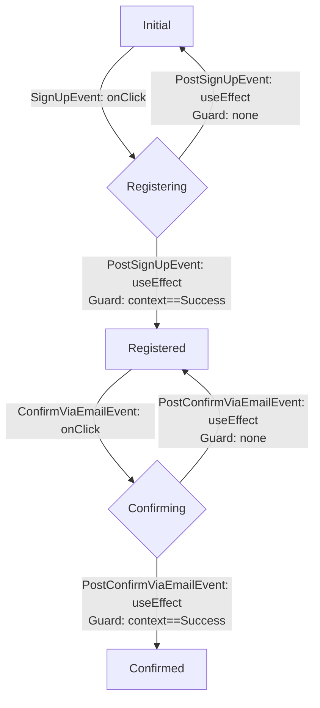

# はじめに

Next.jsでNextAuth.js（auth.js）を使ってサインアップ画面を作っていきます。
Next.jsはSSR（Server-side Rendering, or Dynamic Rendering）が基本だと思っているのですが、フォームを扱う場合にはCSR（Client-side Rendering）で行う必要があります。
Next.jsでユーザーのインタラクティブな操作を伴う場合、どうしてもサーバー側でのレンダリングではなく、クライアントサイドでのレンダリングが必要なためです。

Cognitoでメールログインを扱う場合、メールとパスワードを入力する画面・メールを認証する確認コードを入力する画面・登録完了画面・エラー画面など扱うべき状態があります。
useContextやjotai、Reduxでも状態そのものの管理はできるのですが、状態遷移を含めた管理は結局のところユーザーにゆだねられるので難しくコードが煩雑になりがちだと思っています。

そこで、状態遷移をシンプルにする`XState`を使って楽に管理していきます。
https://zenn.dev/aldagram_tech/articles/59407d4546301d


## やりたいこと

XStateを使って状態遷移を管理する部分をライブラリに則って、独自実装にならないようにします。

UI部分にはMantineを使っています。`@mantine/form`の`useForm`はXStateのcontextを使ったら不要な気もするのですが、バリデーションが便利なので使っています。

本記事ではサインアップの処理に[@aws-sdk/client-cognito-identity-provider](https://docs.aws.amazon.com/AWSJavaScriptSDK/v3/latest/client/cognito-identity-provider/)を利用していますが、以下の記事のようにAmplifyを利用しても良いかと思います。

https://zenn.dev/gsy0911/articles/aceb830e4c1e6e

ちなみに、サインインは以下の拙作をご覧ください（ほぼ同じ構成で作成できます）。

https://zenn.dev/gsy0911/articles/0e271401b8e5c2

## どうして単一のCSRで管理するのか

Next.jsだとSSRを多く使い、単一責任の原則からも1ページ1要素の方が良いかと思います。本記事では、以下の2つの理由からそれに反してサインアップ処理に関しては1つのページでCSRっぽく画面を動かすようにしました。

1. 前のページに意図せずに戻れてしまうこと（rewriteなどすれば回避はできますが、ページへの直アクセスは許してしまいます）。
2. ページの状態を引き継ぐのが難しいため。別のページに飛ぶとユーザー側のステータスを保持することはできなくなってしまいます。基本的に困ることはないのですが、サインアップの処理においてconfirmを実行するときにユーザーのメールアドレスが必要になります。CookieやLocalStorageに保存してもいいのですが、永続化はあまりしたくないのでJavaScriptの変数として持たせるようにしています。

# XStateとは

# Cognitoのサインアップの状態遷移

Cognitoのユーザーの確認の状態遷移は以下のようになります。

> 
> *Cognitoのユーザー確認プロセス（[公式サイト](https://docs.aws.amazon.com/cognito/latest/developerguide/signing-up-users-in-your-app.html)より）*

そのうちサインアップは左側の一部のみなので、本記事では以下の遷移のみ考えます。状態をわかりやすくするために、登録中（Registering）・確認中（Confirming）の状態を追加します。

状態遷移図の文字が多くてわかりづらいですが、「`SignUpEvent: onClick`はボタンなどを押した時にSignUpEventが実行される」、「`PostSignUpEvent: useEffect`はuseEffectで監視しているServerActionsでの結果を元に関数を実行」という意味を表しています。



この状態遷移図を元にXState、およびサインアップの処理を作っていきます。

# コード

全体含めたサンプルコードは以下のリポジトリに置いてあります。適宜確認してください。

https://github.com/gsy0911/zenn-nextjs-authjs-cognito/tree/v6.0

## ディレクトリ構成

ディレクトリ構成は以下のようになっています。👈がついているファイルが今回のサインアップで重要なファイルになっています。なお今回説明するファイルのみの表示となっている点に注意してください。

```
frontend/zenn-app-router
├── app
│  ├── _common
│  │  └── api
│  │     └── cognito
│  │        ├── cognitoConfirmSignUp.ts 👈CognitoSDKの`SignUpCommand`をラップした関数
│  │        └── cognitoSignUp.ts 👈CognitoSDKの`ConfirmSignUpCommand`をラップした関数
│  └── sign-up
│     ├── actions
│     │  └── signUpAction.ts 👈ServerActionsをまとめている
│     ├── page.tsx 👈
│     ├── page.xstate.tsx 👈XStateを利用して、表示切り替えしているCSRのファイル
│     └── stateMachine.ts 👈XStateを定義しているファイル
└── README.md
```

## 準備

XStateを次のコマンドでインストールします。

```shell
$ npm install xstate @xstate/react
```

状態遷移をみたい場合は以下のパッケージもインストールします。
```shell
$ npm install -D @statelyai/inspect
```

なお、今回はUIの部分にMantineを使っています。設定は以下のページをご覧ください。

https://mantine.dev/getting-started/

## Cognitoのサインアップ処理

Cognitoへのサインアップを2つのフォルダに分けて実装していきます。

### `app/_common/api/cognito`フォルダ内

SignUpの処理は以下のSDKを利用します。InputとOutputで型が付与されているので楽に実装できます。特段変わった処理などはしていないです。
https://docs.aws.amazon.com/AWSJavaScriptSDK/v3/latest/client/cognito-identity-provider/command/SignUpCommand/


:::details importと型
```typescript jsx: cognitoConfirmSignUp.ts
"use server";
import {
  CognitoIdentityProviderClient,
  ConfirmSignUpCommand,
  type ConfirmSignUpCommandInput,
  type ConfirmSignUpCommandOutput,
} from "@aws-sdk/client-cognito-identity-provider";
import { genSecretHash } from "./utils";

interface OnAuthConfirmSignUpRequest {
  email: string;
  confirmationCode: string;
}
```
:::

```typescript jsx: cognitoConfirmSignUp.ts
export const cognitoConfirmSignUp = async (props: OnAuthConfirmSignUpRequest): Promise<ConfirmSignUpCommandOutput> => {
  const { email, confirmationCode } = props;
  const { secretHash } = genSecretHash({ email });

  const client = new CognitoIdentityProviderClient({
    region: process.env.COGNITO_REGION,
  });
  const confirmSignUpCommandInput: ConfirmSignUpCommandInput = {
    ClientId: process.env.COGNITO_CLIENT_ID,
    SecretHash: secretHash,
    Username: email,
    ConfirmationCode: confirmationCode,
  };
  const command = new ConfirmSignUpCommand(confirmSignUpCommandInput);
  return await client.send(command);
};
```

Confirmの処理は以下のSDKを利用します。こちらも変わった処理はしていないです。
https://docs.aws.amazon.com/AWSJavaScriptSDK/v3/latest/client/cognito-identity-provider/command/ConfirmSignUpCommand/

:::details importと型
```typescript jsx: cognitoSignUp.ts
"use server";

import {
  CognitoIdentityProviderClient,
  SignUpCommand,
  type SignUpCommandInput,
  type SignUpCommandOutput,
} from "@aws-sdk/client-cognito-identity-provider";
import { genSecretHash } from "./utils";

interface CognitoAuthSignUpProps {
  email: string;
  password: string;
}
```
:::

```typescript jsx: cognitoSignUp.ts
export const cognitoSignUp = async (props: CognitoAuthSignUpProps): Promise<SignUpCommandOutput> => {
  const { email, password } = props;
  const { secretHash } = genSecretHash({ email });

  const client = new CognitoIdentityProviderClient({
    region: process.env.COGNITO_REGION,
  });
  const signUpCommandInput: SignUpCommandInput = {
    ClientId: process.env.COGNITO_CLIENT_ID,
    SecretHash: secretHash,
    Username: email,
    Password: password,
    UserAttributes: [
      {
        Name: "email",
        Value: email,
      },
    ],
  };
  const command = new SignUpCommand(signUpCommandInput);
  return await client.send(command);
};
```


### `app/sign-up/actions`フォルダ内

Server Actionsを使ってクライアントサイドから実行できるようにします。上で定義した`app/_common/api/cognito`内の関数を利用して、Server Actionsとして利用できるようにしています。

全てクライアントサイドで閉じていることから各関数で文字列を返しています。こうすることで、useEffectで状態を監視して次の状態に移るタイミングを確認しています。サーバーサイドで閉じている場合には`next/navigation`の`redirect`関数で遷移しても良いかと思います。

:::details importと型
```typescript jsx: signUpAction.ts
"use server";
import { cognitoSignUp, cognitoConfirmSignUp } from "@/common/api/cognito";
import { UsernameExistsException, CodeMismatchException, ExpiredCodeException, InvalidParameterException } from "@aws-sdk/client-cognito-identity-provider";

interface OnAuthSignUpRequest {
  email: string;
  password: string;
}

interface OnAuthConfirmSignUpRequest {
  email: string;
  confirmationCode: string;
}
```
:::

```typescript jsx: signUpAction.ts
export const onCognitoSignUp = async (_: string | null, formData: OnAuthSignUpRequest) => {
  const { email, password } = formData;

  try {
    await cognitoSignUp({ email, password });
  } catch (err) {
    if (err instanceof UsernameExistsException) {
      return "UsernameExistsException";
    }
    return "Unknown";
  }

  return "Success";
};

export const onCognitoConfirmSignUp = async (_: string | null, formData: OnAuthConfirmSignUpRequest) => {
  const { email, confirmationCode } = formData;

  try {
    await cognitoConfirmSignUp({ email, confirmationCode });
  } catch (err) {
    if (err instanceof ExpiredCodeException) {
      return "ExpiredCodeException";
    } else if (err instanceof CodeMismatchException) {
      return "CodeMismatchException";
    } else if (err instanceof InvalidParameterException) {
      return "InvalidParameterException";
    }
    return "Unknown";
  }

  return "Success";
};
```

## ステートマシン

上述のサインアップの状態をXStateにコードとして起こしていきます。

まずは、イベントを定義します。下のコードの`SignUpEvent`・`ConfirmViaEmailEvent`などです。

```typescript jsx: stateMachine.ts（一部）
import { setup, assign } from "xstate";

type SignUpEvent = { type: "signUp" };
type PostSignUpEvent = { type: "postSignUp"; signUpState: string | null };
type ConfirmViaEmailEvent = { type: "confirmViaEmail" };
type PostConfirmViaEmailEvent = { type: "postConfirmViaEmail"; confirmState: string | null };

type SignUpFlowEvent = SignUpEvent | PostSignUpEvent | ConfirmViaEmailEvent | PostConfirmViaEmailEvent;
```

次に、状態遷移図で共有する状態をContextとして定義します。加えて、Eventが発火した時に更新する`signUpAction`や`confirmAction`のActionを定義します。

```typescript jsx: stateMachine.ts（一部）
type SignUpFlowContext = {
  signUpState: string | null;
  confirmState: string | null;
};

// 現状は assign 関数のジェネリクスに型引数を5つ渡さないとちゃんと型補完が効かなさそうです。
const signUpAction = assign<SignUpFlowContext, SignUpEvent, any, SignUpFlowEvent, any>({
  signUpState: ({ event }) => event.signUpState,
});

const confirmAction = assign<SignUpFlowContext, ConfirmViaEmailEvent, any, SignUpFlowEvent, any>({
  confirmState: ({ event }) => event.confirmState,
});
```

最後に、`initial`や`registering`や`registered`など状態を定義します。そして状態から次の状態に遷移するイベントを`on`で定義します。この時、`type="signUp"`で上で定義したイベントを参照できます。

```typescript jsx: stateMachine.ts（一部）
export const signUpFlowMachine = setup({
  types: {
    context: {} as SignUpFlowContext,
    events: {} as SignUpFlowEvent,
  },
}).createMachine({
  id: "signUpMachine",
  initial: "initial",
  context: {
    signUpState: null,
    confirmState: null,
  },
  states: {
    /**
     * 例えば initial(初期表示) 状態のときに
     * signUp(=SignUpEventで定義している`type`) イベントが発生した場合、
     * registered 状態に遷移する
     **/
    initial: {
      on: {
        signUp: {
          target: "registering",
        },
      },
    },
    registering: {
      on: {
        postSignUp: [
          {
            target: "registered",
            guard: ({ event }) => event.signUpState === "Success",
          },
          {
            target: "initial",
            actions: [signUpAction],
          },
        ],
      },
    },
    registered: {
      on: {
        confirmViaEmail: {
          target: "confirming",
        },
      },
    },
    confirming: {
      on: {
        postConfirmViaEmail: [
          {
            target: "confirmed",
            guard: ({ event }) => event.confirmState === "Success",
          },
          {
            target: "registered",
            actions: [confirmAction],
          },
        ],
      },
    },
    confirmed: {},
  },
});
```

上記の状態遷移のコードを使って、クライアントサイド（CSR）のコードを書いていきます。

:::details importなど
```typescript jsx: page.xstate.tsx
"use client";
import { useEffect } from "react";
import {
  Center,
  TextInput,
  PasswordInput,
  Checkbox,
  Paper,
  Title,
  Text,
  Container,
  Group,
  Button,
  Anchor,
} from "@mantine/core";
import { useFormState } from "react-dom";
import { useForm } from "@mantine/form";
import { onCognitoSignUp, onCognitoConfirmSignUp } from "./actions";
import { useMachine } from "@xstate/react";
import { createBrowserInspector } from "@statelyai/inspect";
import { signUpFlowMachine } from "./stateMachine";
const { inspect } = createBrowserInspector();
// see: https://ui.mantine.dev/category/authentication
```
:::

```typescript jsx: page.xstate.tsx（一部）
export const SignUpXState = () => {
  // 第二引数に inspect 関数を渡すことで、ブラウザ上でステートマシーンを GUI で表示できます。
  const [current, send] = useMachine(signUpFlowMachine, { inspect });
  const [signUpState, signUpAction] = useFormState(onCognitoSignUp, null);
  const [confirmState, confirmAction] = useFormState(onCognitoConfirmSignUp, null);

  const form = useForm({
    initialValues: {
      email: "",
      password: "",
      check: false,
      confirmationCode: "",
    },
    // validateInputOnChange: true,
    validateInputOnBlur: true,
    validate: (values) => {
      if (current.matches("initial")) {
        return {
          email: /^\S+@\S+$/.test(values.email) ? null : "不正なメールアドレスです。",
          password:
            values.password.length < 8
              ? "パスワードは8文字以上入力してください。"
              : !values.password.match(/[0-9]/)
                ? "数字を含めてください"
                : !values.password.match(/[a-z]/)
                  ? "英語の小文字を含めてください"
                  : !values.password.match(/[A-Z]/)
                    ? "英語の大文字を含めてください"
                    : !values.password.match(/[$&+,:;=?@#|'<>.^*()%!-]/)
                      ? "記号を含めてください"
                      : null,
          check: !values.check ? "同意が必要です" : null,
        };
      } else if (current.matches("registered")) {
        return {
          confirmationCode:
            values.confirmationCode === ""
              ? "入力は必須です"
              : values.confirmationCode.length !== 6
                ? "コードの長さが違います。"
                : null,
        };
      }

      return {};
    },
  });
```
  
```typescript jsx: page.xstate.tsx（一部）
  useEffect(() => {
    const updateSignUpState = () => {
      if (signUpState) {
        send({ type: "signUp", signUpState });
      }
    };
    updateSignUpState();
  }, [signUpState]);

  useEffect(() => {
    const updateConfirmationState = () => {
      if (confirmState) {
        send({ type: "confirmViaEmail", confirmState });
      }
    };
    updateConfirmationState();
  }, [confirmState]);

  const onSignUp = () => {
    signUpAction({
      email: form.values.email,
      password: form.values.password,
    });
  };

  const onConfirmViaEmail = () => {
    confirmAction({
      email: form.values.email,
      confirmationCode: form.values.confirmationCode,
    });
    form.setValues({ confirmationCode: "" });
  };

```
  
```typescript jsx: page.xstate.tsx（一部）
  return (
    <Container size={420} my={40}>
      {current.matches("initial") && (
        <>
          <Center>
            <Title c={"#333"}>Welcome!</Title>
          </Center>
          <Center>
            <Text c={"dimmed"} size={"sm"} mt={5}>
              You are to create an account, or{" "}
              <Anchor size="sm" href={"/"}>
                Already have an account
              </Anchor>
            </Text>
          </Center>

          <Paper withBorder shadow="md" p={30} mt={30} radius="md">
            <TextInput label="Email" placeholder="you@mantine.dev" required {...form.getInputProps("email")} />
            <PasswordInput
              label="Password"
              placeholder="Your password"
              required
              mt="md"
              {...form.getInputProps("password")}
            />
            <Group justify={"space-between"} mt="lg">
              <Checkbox label="利用規約に同意する" {...form.getInputProps("check")} />
            </Group>
            <Button fullWidth mt="xl" onClick={onSignUp} disabled={!form.isValid()}>
              Sign up
            </Button>
          </Paper>
        </>
      )}
```
  
```typescript jsx: page.xstate.tsx（一部）
      {current.matches("signUpError") && (
        <>
          <Center>
            <Title c={"#333"}>SignUp Error!</Title>
          </Center>
          <Center>
            <Text c={"dimmed"} size={"sm"} mt={5}>
              {current.context.signUpState}.{" "}
              <Anchor size="sm" href={"/"}>
                try again.
              </Anchor>
            </Text>
          </Center>
        </>
      )}
```
  
```typescript jsx: page.xstate.tsx（一部）
      {current.matches("registered") && (
        <>
          <Center>
            <Title c={"#333"}>Confirm now!</Title>
          </Center>
          <Center>
            <Text c={"dimmed"} size={"sm"} mt={5}>
              Set up is almost complete
            </Text>
          </Center>

          <Paper withBorder shadow="md" p={30} mt={30} radius="md">
            <TextInput
              label="Confirmation code"
              placeholder="000111"
              required
              {...form.getInputProps("confirmationCode")}
            />
            <Text c={"red"} size={"xs"}>
              {current.context.confirmState === "CodeMismatchException" && form.values.confirmationCode === "" && (
                <>コードが一致しません</>
              )}
            </Text>

            <Button fullWidth mt="xl" onClick={onConfirmViaEmail} disabled={!form.isValid()}>
              Confirm
            </Button>
          </Paper>
        </>
      )}
```
  
```typescript jsx: page.xstate.tsx（一部）
      {current.matches("confirmed") && (
        <>
          <Center>
            <Title c={"#333"}>Sign Up Complete!</Title>
          </Center>
          <Center>
            <Text c={"dimmed"} size={"sm"} mt={5}>
              Welcome to our Site.
            </Text>
          </Center>
          <Button fullWidth mt="xl" component={"a"} href={"/"}>
            Back home to Sign-in
          </Button>
        </>
      )}
    </Container>
  );
};
```


## 動作確認

## やっていないこと

### ファイル分割

ファイル分割をもう少ししたかったのですが、XStateをuseContextなどで扱う方法がわからなかったのと、XStateのActor利用した場合にinspectをどう扱うのかが見えなかったので一旦単一のファイルで扱うようにしています。
ファイルの命名規則なども悩みそうなのでこの形でもいいかなと思います。

Mantineの方は、`createFormContext`を利用するとファイル分割をしやすくなります。

https://mantine.dev/form/create-form-context/

### useActionStateの利用

本記事では`useFormState`を利用しています。ただ今後は、もうすぐリリースされるReact 19に含まれる新機能の`useActionState`を使ったほうが良いかと思います。

https://ja.react.dev/reference/react/useActionState

# おわりに

本記事では、サインアップ画面をXStateを利用して状態遷移を意識して作成しました。Next.jsを利用している場合だとURLごとにページを作成した方がいいかと思うのですが、Pages Routerを利用しているみたいにCSR側で全てまとめました。

とりあえずサインアップ画面だけなので、他の画面も合わせて作成していきたいかなと思います。

# 参考記事

https://docs.aws.amazon.com/cognito/latest/developerguide/signing-up-users-in-your-app.html
